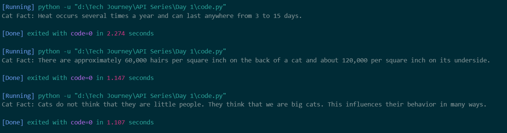

# Code Walkthrough
**Today we call a free public API to apply the fundamental stuff of API** 
1. **import requests** - It will load requests library to make API calls
2. **url = "....."** - We define API endpoint from where we will get response
3. **response = requests.get(url)** - It will fetch data from API
4. **response.json()** - convert raw data into json format
5. Finally we are simply printing data of 'fact key'

# Output Screenshot
