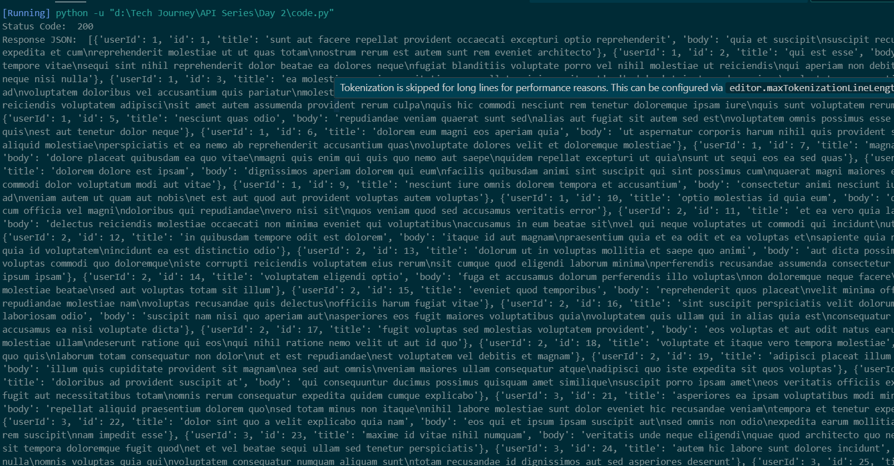
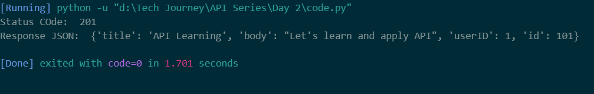

**Explanation** 

**First Part** 
1. *import requests :* - It will load the request library to make API calls 
2. *url = "https://jsonplaceholder.typicode.com/posts"* - I set the API endpoint or url of the API (I am using free public API)
3. *response = requests.get(url* - get() will send request to web/API endpoint to fetch data
4. *print(response.status_code)* - It will print status code i.e., will tell us whether API call worked or fail like # 200 if pass and 404 if not found
5. *response.json()* - It will parsed json data 
# Output

**Second Part** 
1. We define a data dictionary 
2. we are making post request and sending data to API. Inside that we pass out url and data in json format
3. again printing status code whether api call worked or fail like # 201 if created
4. We are simply printing response 

# Output

## "Take a loop in code.py for full code"